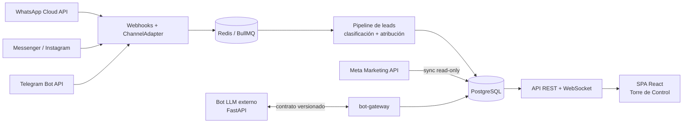

# recruit-ops-ai — CRM/ATS AI-native para reclutamiento operativo

CRM/ATS omnicanal y multiempresa para **reclutamiento operativo de alto volumen** (foco
inicial: operadores de tráiler / quinta rueda en logística y transporte). Los candidatos
llegan solos por webhooks de los canales, las campañas se miden con datos reales de Meta, y
un bot LLM externo puede atender conversaciones — campañas, chats y datos en un solo sitio.

La SPA (interfaz «Torre de Control») consume la API del backend: **no hay datos locales ni
ingestión manual de chats**.

## Principio de diseño

> Cada decisión operativa la toma un motor determinista evaluando configuración; la IA solo
> aporta entradas (datos extraídos **con evidencia**) y salidas (mensajes redactados dentro
> de límites). El CRM es la fuente de verdad: estados, reglas, horarios, historial.

En la práctica esto significa cuatro reglas que el código respeta de forma estricta:

- **La IA nunca decide.** No mueve un candidato a viable/descartado/contratado, no inventa
  vacantes ni datos. Opera por tool-calling contra un catálogo cerrado que valida el backend.
- **Nada de negocio hardcodeado.** Empresas, circuitos, tipos de vacante, estados, metas,
  horarios y zonas horarias son datos configurables desde la UI de Administración.
- **Todo dato extraído lleva evidencia**: cita textual + fuente, para poder auditarlo.
- **UTC en almacenamiento**; los horarios se evalúan contra la zona IANA del schedule, nunca
  contra la del servidor.

## Arquitectura



- **Backend** (`server/`): NestJS monolito modular · PostgreSQL (Drizzle) · Redis + BullMQ ·
  almacenamiento S3-compatible para media · log de eventos append-only (`domain_events`) como
  fuente de métricas y auditoría. Detalle en [`server/README.md`](server/README.md).
- **Frontend** (`src/`): React 19 + Vite + Tailwind 4 · vistas de Resumen del periodo, Bandeja
  de Leads (CRM) con visor de chat en vivo, Atribución y Contratos, Capacidad y Metas,
  Rendimiento Campañas, Cobertura y Horarios, Cargar Datos y Administración.
- **Bot**: servicio FastAPI externo (repo aparte) detrás del contrato del `bot-gateway`, con
  lock atómico para el handoff bot ↔ humano.

## Qué hace hoy

**Canales y conversaciones** — WhatsApp Cloud API, Messenger, Instagram y Telegram bajo un
`ChannelAdapter` común; múltiples cuentas por canal con ruteo del entrante a la cuenta que lo
recibió; credenciales cifradas en base de datos (AES-256-GCM), no en variables de entorno.
Inbox en vivo por WebSocket, envío saliente con ventana de 24 h, plantillas y estado de
entrega. Media (audio/imagen/documento) descargada en background a S3.

**Pipeline de candidatos** — mensaje → conversación → lead, con clasificación determinista,
deduplicación por teléfono normalizado y atribución de campaña automática por el `referral`
de los anuncios Click-to-WhatsApp.

**Campañas** — sincronización read-only con Meta Marketing API (gasto, clicks, leads reales);
ofertas versionadas por campaña con publicación inmutable (borrador → publicada; la vigente se
deriva, nunca es una bandera editable).

**Ciclo de vida laboral** — episodio de contratación inmutable por operador (con snapshot de
reclutador, campaña y oferta vigente al contratar), bajas históricas y analítica de permanencia
(mediana, hitos 30/60/90 días, desglose por tipo y por circuito).

**Capacidad operativa** — snapshot de HC autorizado vs. real por circuito, déficit calculado,
participación de cada circuito en la necesidad total, y aviso cuando el reporte fuente
discrepa del cálculo (para validación humana, sin que el sistema decida cuál vale).

**Configuración** — catálogos de dominio, metas por periodo, horarios y campos personalizados
(diccionario tipado con valores + evidencia) editables desde la UI.

## Arranque local

Requisitos: Node 22+, Docker.

```bash
# 1. Infraestructura (Postgres 16 + Redis 7)
docker compose up -d --wait

# 2. Backend
cp .env.example .env          # ajustar credenciales de canales si se tienen
cd server && npm install && npm run db:migrate && npm run dev   # → http://localhost:3001

# 3. Frontend (en otra terminal, desde la raíz)
npm install && npm run dev    # → http://localhost:5173
```

La SPA apunta por default a `http://localhost:3001`; se cambia con `VITE_API_BASE_URL`.
Sin backend accesible, la UI muestra un banner de error de conexión (nunca datos falsos).

El sistema arranca sin credenciales de canal: los webhooks responden 403 y el envío devuelve
`CHANNEL_NOT_CONFIGURED`, sin impedir el resto de la aplicación.

## Cómo llegan los datos

- **Chats**: webhooks de los canales (`/webhooks/meta`, `/webhooks/telegram/:accountId`) — nada que
  importar; cada mensaje crea/actualiza su candidato y aparece en vivo por WebSocket.
- **Campañas**: Meta Marketing API (sync periódico); CSV como fallback/histórico.
- **Cargas administrativas** (vista Cargar Datos, todas idempotentes): directorio de
  operadores, snapshot de capacidad HC, pautas semanales de Meta, bajas de RH e histórico de
  chats exportados —este último solo para backfill de conversaciones previas a la migración.
- **Catálogos, metas, horarios y campos personalizados**: vista Administración → API.

## Desarrollo

```bash
cd server && npm test    # suite del backend (necesita docker compose arriba)
cd server && npm run lint   # typecheck estricto del backend
npm run lint             # typecheck de la SPA (desde la raíz)
```

El proyecto usa **OpenSpec Driven Development**: ningún cambio de código sin un change
aprobado en `openspec/changes/`. Cada capacidad del sistema tiene su especificación en
`openspec/specs/`, y el contexto de producto y arquitectura —tesis, decisiones, roadmap y
restricciones no negociables— vive en [`openspec/project.md`](openspec/project.md), que es la
fuente de verdad de las decisiones de diseño.

## Estado

Fases F0–F2 completadas: fundación de backend, canales nativos entrantes y salientes, SPA
sobre la API, sincronización de campañas, bot-gateway y catálogos configurables.

En curso hacia F3: gestión de campañas desde el CRM (condicionada a App Review de Meta), score
auditable de candidatos, documentos y seguimientos. El backlog de gaps detectados se mantiene
al final de `openspec/project.md`.

## Interfaz

<!-- CAPTURA: vista Resumen del periodo (Torre de Control) con métricas de campañas y contrataciones. -->
<!-- CAPTURA: Bandeja de Leads con el visor de chat en vivo y el panel de datos extraídos con evidencia. -->
<!-- CAPTURA: vista Administración mostrando catálogos y campos personalizados configurables sin código. -->

## Qué construí

El sistema completo, backend y frontend:

- **Backend NestJS** — módulos de canales bajo un `ChannelAdapter` común, pipeline de leads con
  clasificación determinista y deduplicación, cifrado de credenciales en base de datos,
  sincronización con Meta Marketing API, `bot-gateway` con lock atómico para el handoff
  bot ↔ humano, y el log append-only de `domain_events` que sirve de fuente a métricas y
  auditoría.
- **Modelo de datos** en PostgreSQL con Drizzle: episodios de contratación inmutables, ofertas
  versionadas, snapshots de capacidad y el diccionario tipado de campos personalizados con
  evidencia.
- **SPA React 19** — las vistas de la Torre de Control, incluido el inbox en vivo por WebSocket.
- **Las especificaciones**: cada capacidad descrita en `openspec/specs/` antes de existir en
  código, con el contexto de producto y las decisiones de arquitectura en
  [`openspec/project.md`](openspec/project.md).

La decisión de la que más aprendí es la de la portada: **la IA nunca decide**. Es tentador
dejar que el modelo mueva un candidato a "viable"; mantener al LLM en las entradas y salidas,
y las decisiones en un motor determinista que evalúa configuración, es lo que hace el sistema
auditable y adaptable a otra empresa sin tocar código.

## Autor

**David Ramos** — Data / AI Engineer

[LinkedIn](https://www.linkedin.com/in/david-ramos-anguiano-3a647827a/) · david.24000@hotmail.com
